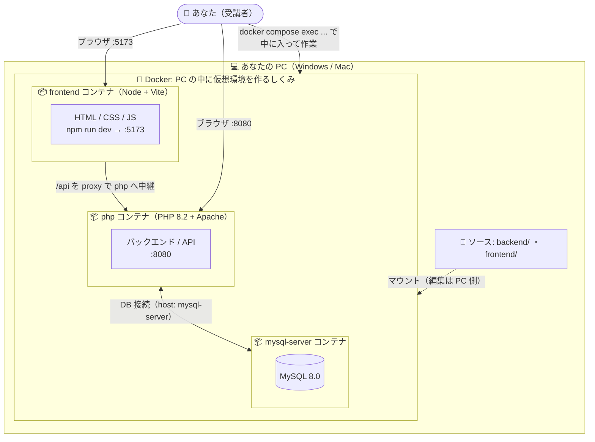

# LMS 開発環境

エンジニア育成カリキュラム用の開発環境です。

## Docker のしくみ

このカリキュラムでは **Docker** を使います。Docker は、**あなたの PC の中に「コンテナ」という仮想的な作業環境を作るしくみ**です。

- PHP や MySQL を PC へ直接インストールする必要はありません。必要なソフトはすべてコンテナの中に入っています。
- そのため OS（Windows / Mac）が違っても、**全員がまったく同じ環境**で学習できます。
- ファイルは PC 側のエディタで編集し、コマンドを動かすときは「コンテナに入って」実行します（手順は後述の「使い方」）。



> 📦 のコンテナは「使い捨ての環境」です。壊れても `docker compose down` → `up` でいつでもクリーンな状態に戻せます。

## 動作環境

- Windows（Docker Desktop）
- macOS Intel（Docker Desktop）
- macOS Apple Silicon（Docker Desktop）

## 構成

| サービス | URL | 用途 |
|----------|-----|------|
| Vite（フロント） | http://localhost:5173 | フロントエンド（HTML/CSS/JS・自動リロード） |
| PHP + Apache | http://localhost:8080 | バックエンド（PHP実行） |
| MySQL 8.0 | localhost:3306 | データベース |

## セットアップ

```bash
cd lms-environment
docker compose up -d
```

http://localhost:8080 にアクセスして動作確認画面が表示されればOK。フロントエンドは http://localhost:5173 で開きます（初回は frontend コンテナの `npm install` に少し時間がかかります）。

## ディレクトリ構成

```
lms-environment/
├── backend/          ← PHP ファイルを置く場所
│   └── public/       ← Web公開ディレクトリ（ここがドキュメントルート）
│       └── index.php
├── frontend/         ← フロントエンド（Vite + HTML/CSS/JS）
│   ├── index.html
│   ├── style.css
│   ├── app.js
│   ├── package.json
│   └── vite.config.js
├── docker/
│   └── php/
│       └── Dockerfile
└── docker-compose.yml
```

## 使い方

### バックエンド（PHP）— 第3章〜

`backend/public/` に PHP ファイルを作成すると `http://localhost:8080/ファイル名.php` でアクセスできます。

```php
<?php
// backend/public/hello.php
echo 'Hello, World!';
```

### コンテナに入って PHP を実行する — 第3章〜

`php` や `composer` などのコマンドは、受講者の PC に直接インストールせず、**コンテナの中に入って実行します**。こうすることで OS（Windows / macOS）に関わらず、全員が同じ PHP バージョン・同じ環境で学習できます（受講者ごとの環境差をなくすため）。

コンテナに入る:

```bash
docker compose exec php bash
```

プロンプトが `root@xxxxxxxx:/var/www/html#` に変わればコンテナの中です。`backend/` が `/var/www/html` に対応しているので、`backend/` に置いたファイルをそのまま実行できます。

例として `backend/helloworld.php` を用意して実行します:

```php
<?php
// backend/helloworld.php
echo 'Hello, World!';
```

```bash
php helloworld.php   # => Hello, World!
php -v               # PHP のバージョン確認
```

作業が終わったらコンテナから出る:

```bash
exit
```

### データベース（MySQL）— 第4章〜

MySQL コンソールへは、MySQL コンテナに入ってから接続します:

```bash
docker compose exec mysql-server bash   # MySQL コンテナに入る
mysql -u lms_user -plms_pass lms        # MySQL コンソールに接続（パスワードは -p の直後に続けて書く）
```

`mysql>` プロンプトが出れば成功です。`exit` で MySQL コンソールを抜け、もう一度 `exit` でコンテナから出ます。
（`Using a password on the command line interface can be insecure.` という警告は出ますが、学習環境では無視して構いません。）

PHP からの接続情報:

| 項目 | 値 |
|------|-----|
| ホスト | mysql-server |
| データベース名 | lms |
| ユーザー名 | lms_user |
| パスワード | lms_pass |

```php
<?php
$pdo = new PDO('mysql:host=mysql-server;dbname=lms;charset=utf8mb4', 'lms_user', 'lms_pass');
```

### フロントエンド（HTML/CSS/JavaScript）— 第2章・第8章

`docker compose up -d` で frontend コンテナ（Vite 開発サーバ）が起動します。ブラウザで **http://localhost:5173** を開いてください。`frontend/` のファイルを保存すると自動でリロードされます。

npm コマンドを使うときはコンテナに入って実行します:

```bash
docker compose exec frontend sh   # frontend コンテナに入る
npm install <パッケージ名>          # 例: パッケージを追加
```

PHP の API を呼ぶときは `/api/...` 宛てに `fetch` すると、Vite が php コンテナへ中継します（同一オリジン扱いで CORS 不要）:

```js
// frontend/app.js
const res = await fetch('/api/hello.php');  // → php コンテナの public/api/hello.php
const data = await res.json();
```

> 第8章で React 等を導入する場合も、`@vitejs/plugin-react` と `react` を追加するだけで `npm run dev` の構成のまま移行できます。
> ポート 5173 が他の Vite 等で使用中だと起動に失敗します。その場合は使用中のプロセスを止めてください。

### Laravel — 第6章〜

コンテナ内で Laravel プロジェクトを作成します:

```bash
docker compose exec php bash
composer create-project laravel/laravel .
```

## 停止・削除

```bash
# 停止
docker compose down

# データベースも含めて完全に削除
docker compose down -v
```
